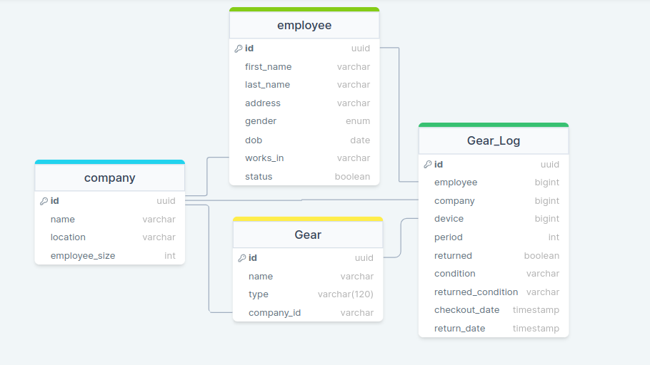

# ERD of the project

# Install Pipenv if isn't installed

`pip install pipenv`

## Install Dependencies

`pipenv install`

## Activate virtualenv

`pipenv shell`

## database

`python manage.py migrate`

## development

`python manage.py runserver`

## Deactivate project

`ctrl+D or exit`

# API

- localhost:8000/

  - api/test -> test purpose
  - api/company ->GET(show all), POST(entry a company)
  - api/company/1 ->GET(company details), PATCH(update company), DELETE(delete a company)

  - api/employee -> GET(show all employee), POST(entry an Employee)
  - api/employee -> GET(Employee details with company details), PATCH(update an Employee), DELETE(delete an employee)

  - api/gear ->GET(show all), POST(entry a gear)
  - api/gear/1 ->GET(gear details), PATCH(update gear), DELETE(delete a gear)

  - api/company/1/employees -> GET(all employees under a company)
  - api/company/1/employees?status=boolean -> GET(current or former employees under a company)
  - api/company/1/gears -> GET(all gears under a company)

  - api/gear-log ->GET(show all logs), POST(entry a log)
  - api/gear-log?returned=boolean&start_date=Isodateformat ->GET(show all logs returned, within date range)
  - api/gear-log/1 ->GET(log details), PATCH(update log), DELETE(delete a log if returned True)
  - api/company/1/logs -> GET(all logs of a company)
  - api/company/1/logs?returned=boolean -> GET(all returned gear logs)
  - api/company/1/logs?returned=boolean&start_date=Isodateformat&remaining_days -> GET(all returned gear logs within a date range, less than remaining_days )

  - api/employee/1/logs -> GET(all logs of an employee)
  - api/employee/1/logs?returned=boolean -> GET(all returned gear logs)

## API collections

> Check content folder for POSTMAN/THUNDER CLIENT test collections
